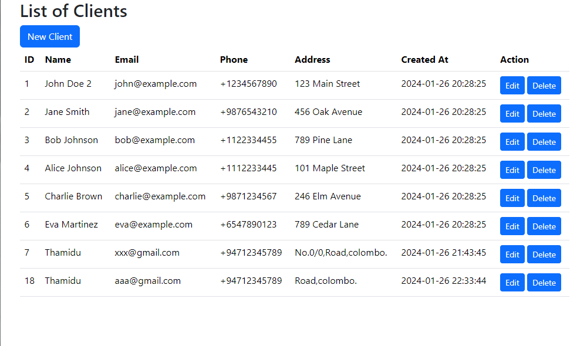
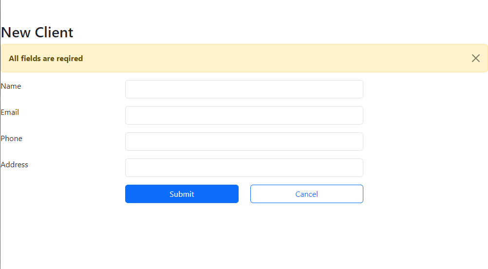
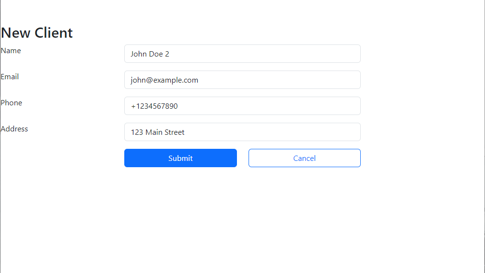

Create Web Applications using PHP and MySQL. And how to connect to MySQL database using PHP. And how to fill the HTML table from the database using PHP. And how to perform CRUD operations using PHP and MySQL.

SQL Queries-----------------
CREATE TABLE clients(

id INT NOT NULL PRIMARY KEY AUTO_INCREMENT,

  name VARCHAR (100) NOT NULL,
  
  email VARCHAR (200) NOT NULL UNIQUE,
  
  phone VARCHAR (20) NULL,
  
  address VARCHAR (200) NULL,
  
  created_at DATETIME NOT NULL DEFAULT CURRENT_TIMESTAMP
  
);

INSERT INTO clients(name,email,phone,address)

VALUES

('John Doe', 'john@example.com', '+1234567890', '123 Main Street'),

('Jane Smith', 'jane@example.com', '+9876543210', '456 Oak Avenue'),

('Bob Johnson', 'bob@example.com', '+1122334455', '789 Pine Lane'),

('Alice Johnson', 'alice@example.com', '+1112233445', '101 Maple Street'),

('Charlie Brown', 'charlie@example.com', '+9871234567', '246 Elm Avenue'),

('Eva Martinez', 'eva@example.com', '+6547890123', '789 Cedar Lane');

